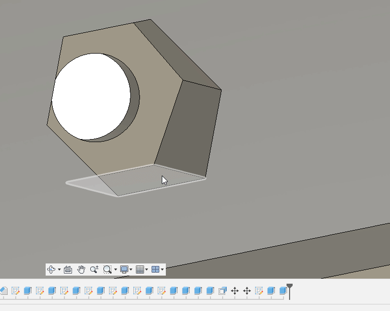
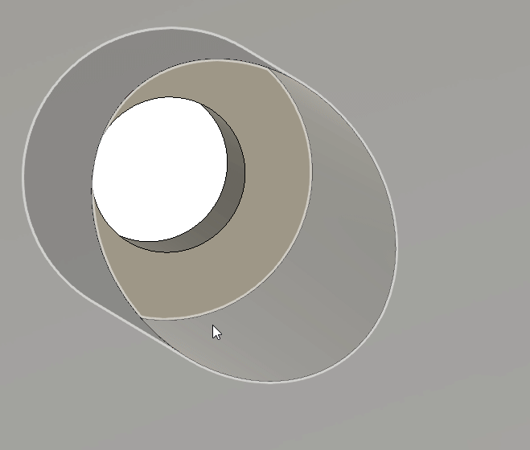
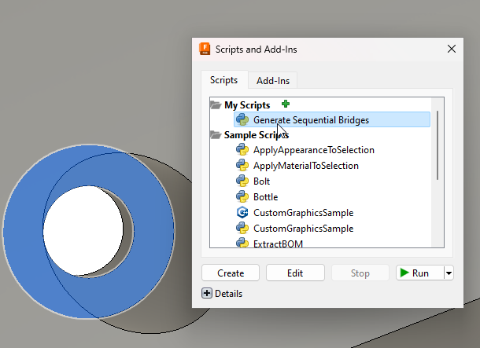

# Fusion 360 Script - Generate Sequential Bridges

This is an Autodesk Fusion 360 script that will automatically generate sequential bridges cf. [[1](https://www.youtube.com/watch?v=KBuWcT8XkhA),[2](https://wuxn3d.com/blogs/informative/your-go-to-guide-for-designing-3d-models-for-fdm-printing),[3](https://hydraraptor.blogspot.com/2014/03/buried-nuts-and-hanging-holes.html?m=1)] used for FDM 3D printing.





# Installation

See the official [guide](https://www.autodesk.com/support/technical/article/caas/sfdcarticles/sfdcarticles/How-to-install-an-ADD-IN-and-Script-in-Fusion-360.html).

Basically just put the files of this repo in a folder called *Generate Sequential Bridges* in e.g., `C:\Users\yourname\AppData\Roaming\Autodesk\Autodesk Fusion 360\API\Scripts\`

then you should be able to see the script by going to Utilities -> Add-ins -> My Scripts 

or by pressing SHIFT+S

## Usage



1. Click one or more valid surfaces (see images above)
2. Open upp the script by e.g., SHIFT+S
3. Click Run


# Configuration

The extrusion amount is hardcoded in the beginning of the *Generate Sequential Bridges.py* script. The line 
````
extrusionAmount = ("-0.5 mm", "-0.25 mm")
````
can be changed to suit your needs. The default assumes 0.2mm layer hight.